# Peer-to-Peer Distributed File Sharing System

A group-based peer-to-peer file sharing system in C++11, in the style of BitTorrent.

- **Two trackers** hold the users, groups and file hashes, and stay synchronised with each other. No file data passes through them.
- **Clients** are downloader and seeder at the same time. A file is cut into 512 KB pieces, fetched from several peers in parallel, and every piece is checked with SHA-1.
- **Every connection is TLS**, passwords are stored only as salted hashes, and a seeder gives pieces only to members of the group.

```
        Tracker 1  <──── sync ────>  Tracker 2          users, groups, hashes (small text)
           ▲   ▲                        ▲
           │   │                        │
        Alice  Bob  <── pieces ──>   Carol              the files themselves, directly
```

A full write-up with diagrams is in [Technical report.pdf](Technical%20report.pdf).

## Contents

- [What is implemented](#what-is-implemented)
- [Requirements](#requirements)
- [Build](#build)
- [Run it step by step](#run-it-step-by-step)
- [Check everything](#check-everything)
- [Security checks](#security-checks)
- [Start again from nothing](#start-again-from-nothing)
- [Shortcut script](#shortcut-script)
- [Problems you may see](#problems-you-may-see)
- [Commands](#commands)
- [Architecture](#architecture) · [Key algorithms](#key-algorithms) · [Data structures](#data-structures) · [Network protocols](#network-protocols) · [Security](#security) · [Assumptions](#assumptions) · [Limitations](#limitations)

> **About the screenshots.** They show the real output of one complete run of the commands below (two trackers, three clients, on macOS), drawn as terminal windows. Lines longer than the window are cut with `…`. Key fingerprints and password hashes are random, so yours will differ.

---

## What is implemented

| Feature | Where to see it below |
|---|---|
| User accounts, login, logout | [Alice](#terminal-a--alice-uploader--seeder) |
| Groups: create, join request, accept, leave, list | [Alice](#terminal-a--alice-uploader--seeder), [Bob](#terminal-b--bob-downloader), [Leave and logout](#leave-a-group-logout) |
| Upload: 512 KB pieces, SHA-1 of every piece and of the file | [Alice](#terminal-a--alice-uploader--seeder) |
| Download in the background, `show_downloads`, `[C] [group] file` | [Bob](#terminal-b--bob-downloader) |
| One file from several peers at once, rarest piece first | [Carol](#terminal-c--carol-downloads-from-two-peers) |
| A client seeds what it downloaded, even while still downloading | [Carol](#terminal-c--carol-downloads-from-two-peers) |
| A damaged piece is detected and fetched from another peer | [A peer with a damaged copy](#a-peer-with-a-damaged-copy) |
| Two trackers kept the same by a numbered operation log | [The two trackers stay the same](#the-two-trackers-stay-the-same) |
| A client switches tracker by itself when one stops | [A tracker stops](#a-tracker-stops) |
| No memory leaks, clean shutdown | [Memory leaks](#memory-leaks) |
| TLS on every link, trackers checked through a private certificate authority | [Security checks](#security-checks) |
| Passwords stored only as salted PBKDF2 hashes | [Passwords are not stored](#passwords-are-not-stored) |
| A seeder serves only members of the group | [A stranger asks a seeder for a file](#a-stranger-asks-a-seeder-for-a-file) |

---

## Requirements

- Linux or macOS, `g++` with C++11, `make`
- OpenSSL 1.1.1 or newer, with headers, and the `openssl` command
  - macOS: `brew install openssl@3`
  - Ubuntu: `sudo apt install build-essential libssl-dev openssl`
- For the checks only: `nc`, `xxd`, `python3`

---

## Build

```
git clone https://github.com/ShubhamKumarSunny/peer-to-peer.git
cd peer-to-peer

cd tracker
make clean && make
make cert              # only the first time: makes the certificate files in the project folder

cd ../client
make clean && make
cd ..
```

`make cert` creates, next to `tracker_info.txt`:

| File | Purpose | Who needs it |
|---|---|---|
| `ca_cert.pem` | certificate of the project's own small certificate authority | both trackers and every client |
| `ca_key.pem` | the authority's private key; only signs tracker certificates | nobody at run time |
| `tracker1_cert.pem`, `tracker1_key.pem` | tracker 1's certificate and private key | tracker 1 |
| `tracker2_cert.pem`, `tracker2_key.pem` | tracker 2's | tracker 2 |

These files are not in the repository: everyone makes their own. Without them the programs do not start (there is no unencrypted mode).

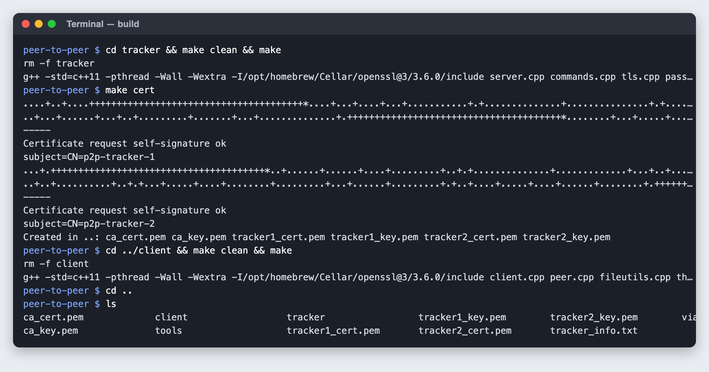

---

## Run it step by step

Open five terminals. `tracker_info.txt` lists the two trackers:

```
127.0.0.1:4000
127.0.0.1:4001
```

### Terminal T1 — tracker 1

```
cd tracker
./tracker ../tracker_info.txt 1
```

### Terminal T2 — tracker 2

```
cd tracker
./tracker ../tracker_info.txt 2
```

Watch for, in both: `Connected to peer tracker at ... (resent 0 operations)`. Typing `quit` stops a tracker.

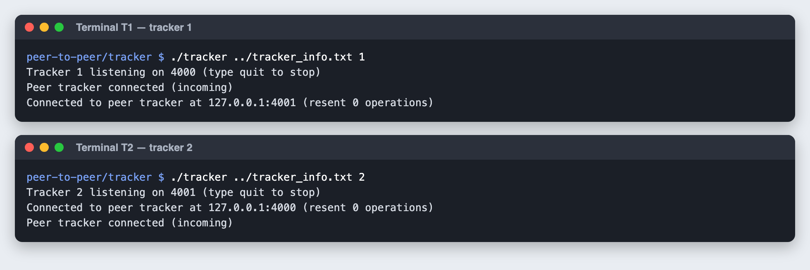

### Terminal A — Alice (uploader / seeder)

```
cd client
# prepare two files
echo "hello world" > testfile.txt
head -c 3000000 /dev/urandom > movie.bin
# 127.0.0.1:5001 is alice's OWN address; the trackers come from the file
./client 127.0.0.1:5001 ../tracker_info.txt
```

Inside Alice's client:

```
create_user alice p1
login alice p1
create_group g1
upload_file g1 testfile.txt
upload_file g1 movie.bin
list_files g1
```

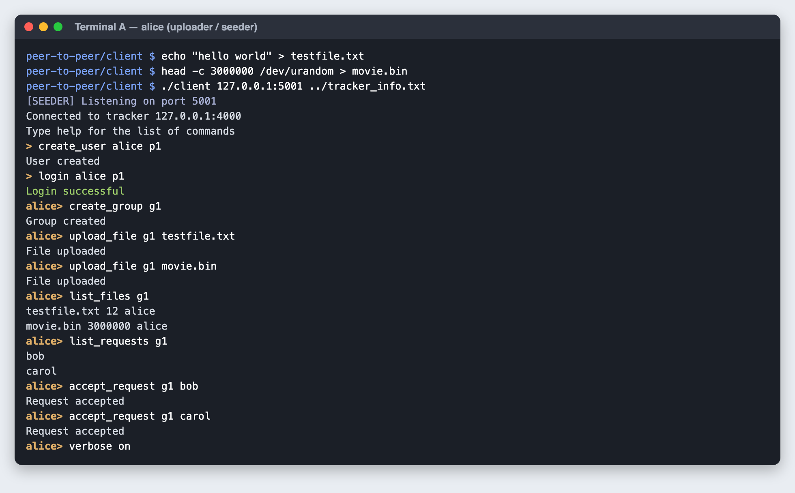

### Terminal B — Bob (downloader)

A client uses the first tracker in its file that answers. To put Bob and Carol on **tracker 2**, give them a copy of the file with the two lines swapped (run once, in the project folder):

```
mkdir -p via2
(sed -n 2p tracker_info.txt; sed -n 1p tracker_info.txt) > via2/tracker_info.txt
cp ca_cert.pem via2/
```

Then:

```
cd client
./client 127.0.0.1:5002 ../via2/tracker_info.txt
```

Inside Bob's client:

```
create_user bob p2
login bob p2
list_groups
join_group g1
```

Alice accepts (inside Alice's client):

```
list_requests g1
accept_request g1 bob
```

Then Bob:

```
list_files g1
download_file g1 testfile.txt DOWN_testfile.txt
download_file g1 movie.bin bob_movie.bin
show_downloads
```

All clients run in the same `client` folder here, so each download is saved under a **different name**. (Otherwise it would overwrite Alice's file. On separate machines, or in separate folders, `download_file g1 movie.bin .` is enough.)

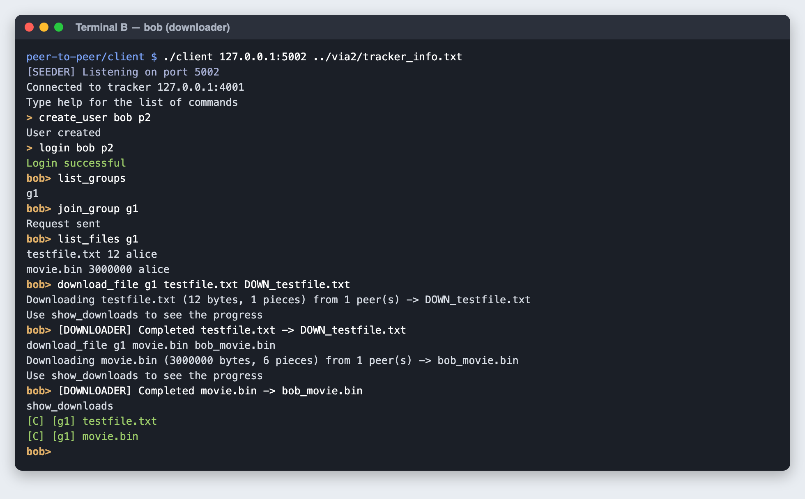

### Terminal C — Carol (downloads from two peers)

```
cd client
./client 127.0.0.1:5003 ../via2/tracker_info.txt
```

Inside Carol's client:

```
create_user carol p3
login carol p3
join_group g1
```

Alice accepts: `accept_request g1 carol`. Alice also types `verbose on` to see what she serves. Then Carol:

```
verbose on
download_file g1 movie.bin carol_movie.bin
show_downloads
```

Watch for: `from 2 peer(s)`, then pieces from **both** `127.0.0.1:5001` (Alice) and `127.0.0.1:5002` (Bob, who was a downloader a minute ago).

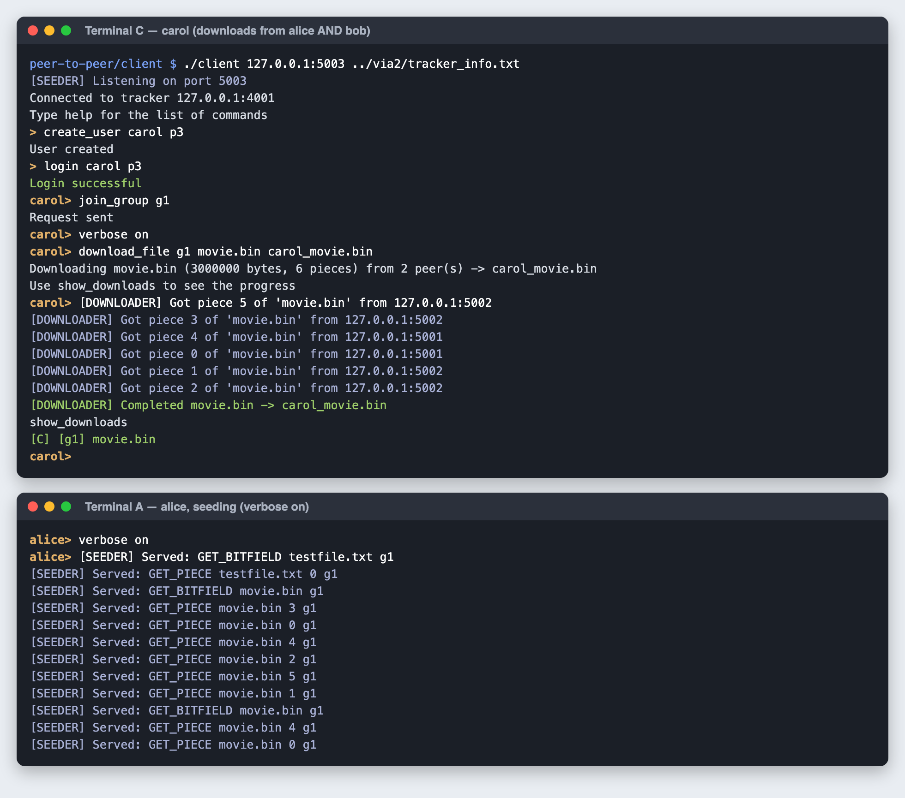

---

## Check everything

Use any free terminal, in the project folder.

### The copies are identical

```
cd client
cmp testfile.txt DOWN_testfile.txt
cmp movie.bin bob_movie.bin
cmp movie.bin carol_movie.bin
```

No output from `cmp` means the files are identical.

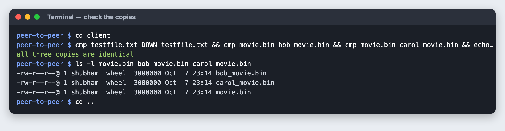

### The two trackers stay the same

Look at the two tracker terminals. A command typed at a client of one tracker shows there as `[SERVER] ...` and on the other tracker as `[SYNC] OP n ...`. Alice is on tracker 1, Bob and Carol on tracker 2, and each tracker knows everything.

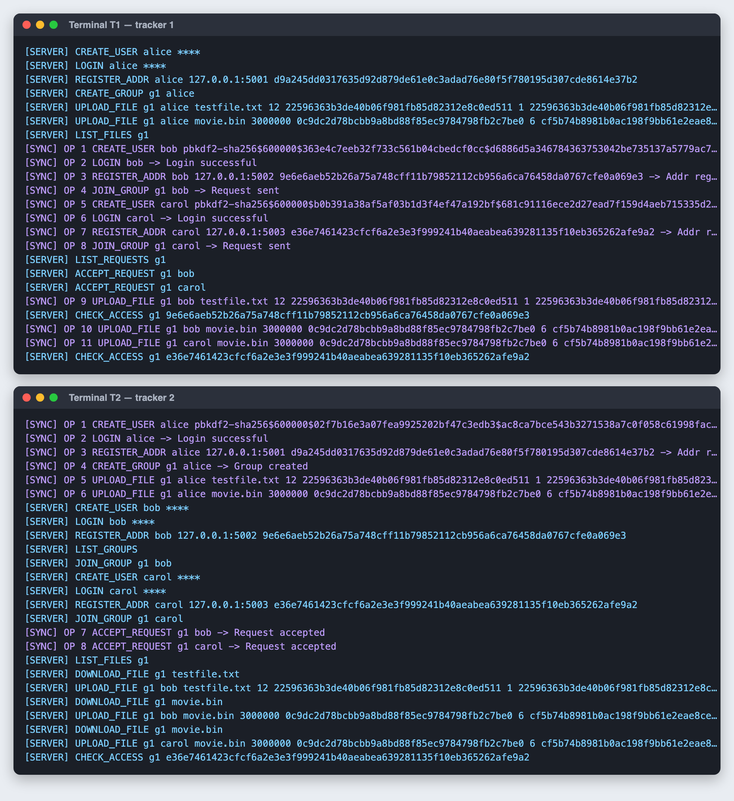

Every operation that changed something is also in `tracker/oplog.txt`, as `<tracker> <number> <command>`. A tracker that restarts replays this file; a tracker that was away is sent what it missed.

```
cut -c1-100 tracker/oplog.txt
```

### Passwords are not stored

```
grep -c 'p1\|p2\|p3' tracker/oplog.txt
grep 'CREATE_USER\|LOGIN' tracker/oplog.txt | cut -c1-100
```

Expected: `0`, then `CREATE_USER alice pbkdf2-sha256$600000$<salt>$<hash>` and `LOGIN alice` with no secret. The tracker terminals show `LOGIN alice ****`.

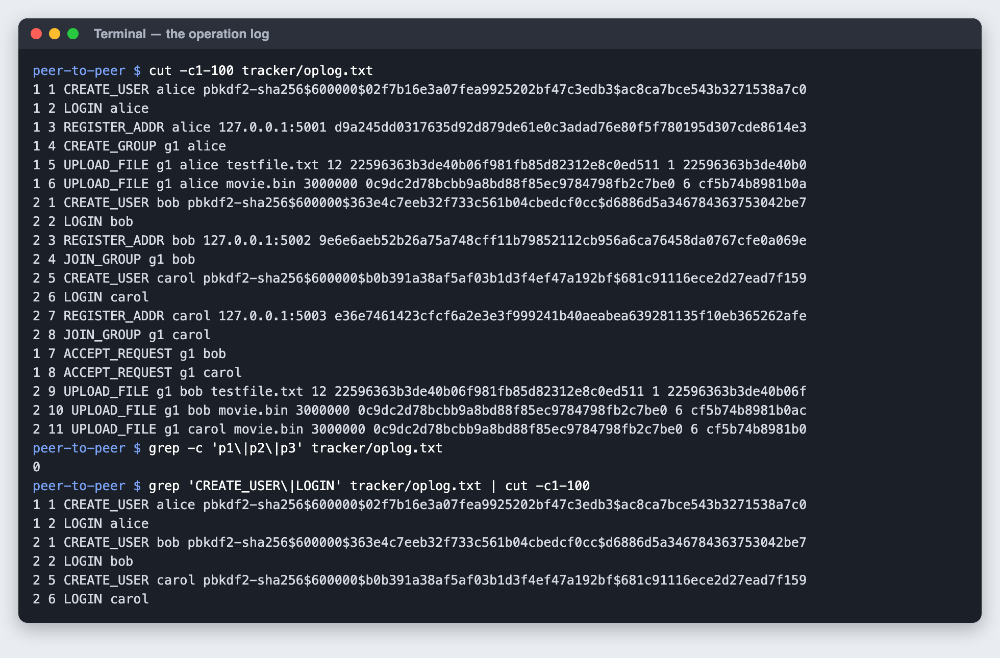

### A peer with a damaged copy

Replace Bob's copy with rubbish of the same size, then let Carol download again:

```
head -c 3000000 /dev/urandom > client/bob_movie.bin
```

Inside Carol's client (she gives up her copy first, then downloads under a new name):

```
stop_share g1 movie.bin
download_file g1 movie.bin carol_again.bin
```

Watch for: `Hash mismatch ... from 127.0.0.1:5002` for every piece that came from Bob, each one fetched again from Alice, then `Completed`.

```
cmp client/movie.bin client/carol_again.bin && echo identical
```

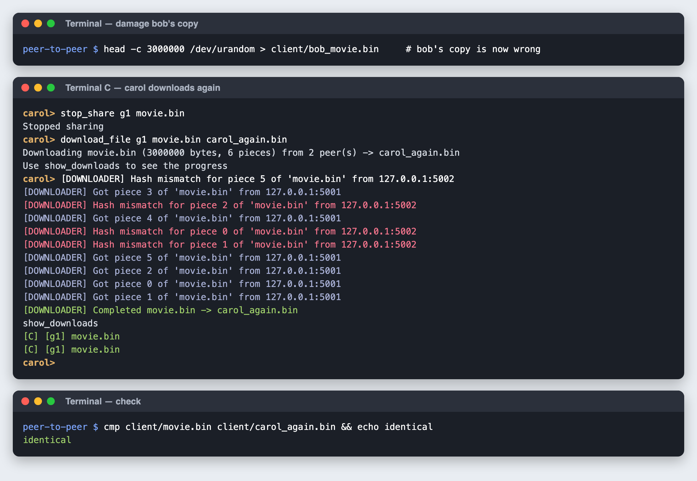

### A tracker stops

In terminal T2 type `quit`. Then inside Bob's client (he was on tracker 2):

```
list_groups
list_files g1
```

Watch for: `Lost connection to tracker, switching...`, `Connected to tracker 127.0.0.1:4000`, and then the normal answers. Bob did not log in again by hand. Start tracker 2 again with the same command as before.

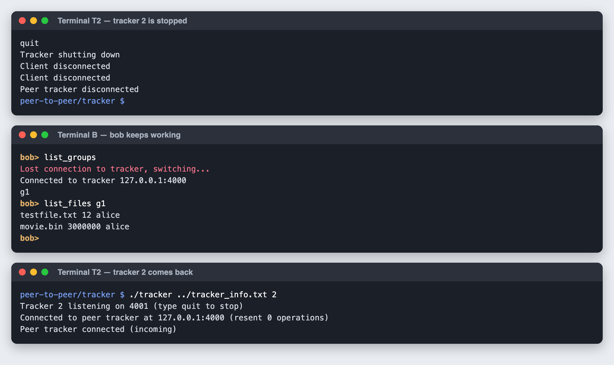

### Leave a group, logout

Inside Carol's client:

```
leave_group g1
list_files g1
logout
quit
```

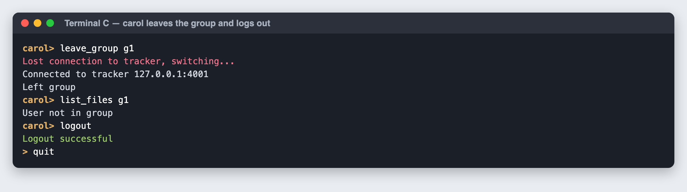

### Memory leaks

macOS (stop Alice's client first so that port 5001 is free):

```
cd client
(printf 'login alice p1\nlist_groups\n'; sleep 2; echo quit) | leaks --atExit -- ./client 127.0.0.1:5001 ../tracker_info.txt 2>&1 | grep 'Login\|leaks for'
```

Linux: `valgrind --leak-check=full ./client 127.0.0.1:5001 ../tracker_info.txt`

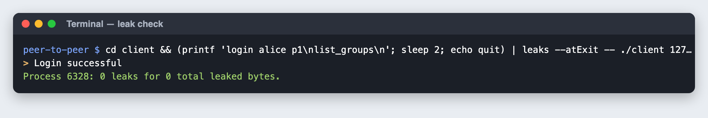

### Deeper checks that were also run

These are not in the walkthrough above. Both programs were built with AddressSanitizer + UBSan and again with ThreadSanitizer (`make CXXFLAGS="-std=c++11 -pthread -g -fsanitize=thread"`), and a scripted session of two trackers and four clients was run on each build: 18 checks passed and the sanitizers reported nothing.

| Check | Result |
|---|---|
| Duplicate user, wrong password, missing file, non-member, non-owner, repeated join request | each refused with its own message |
| An empty file (0 bytes, 0 pieces) | uploaded, listed with size 0, downloaded |
| Two clients download four files each at the same time (12 bytes to 60 MB) | all eight copies identical, no `.part` file left |
| One of three peers frozen (`kill -STOP`) | the request to it gave up after the timeout; the download finished from the others |
| `quit` while a download is running | the client exits and removes the `.part` file |
| A second login of the same user | the older client is told `Session ended on the tracker, please login again` |
| A tracker killed with `kill -9`, then restarted | clients carried on through the other tracker; the restarted one knew what happened meanwhile |
| A client that is still downloading as a source | Carol started when Bob had 394 of 763 pieces of a 400 MB file and received 225 pieces from him |

### Larger files

```
head -c 1073741824 /dev/urandom > client/giga.bin
```

Then `upload_file g1 giga.bin` in one client and `download_file g1 giga.bin giga_copy.bin` in another. Measured on an Apple M1, both clients on one machine: 2.1 s to upload (hash 1 GB), 7.8 s to download, about 12 MB of memory in the client.

---

## Security checks

The trackers and Alice's client must be running. Run these in a free terminal, in the project folder.

### Plain text is refused

```
printf 'CREATE_USER eve pw\n' | nc 127.0.0.1 4000 | xxd
```

Expected: `1503 0300 0202 16`, a TLS alert. Tracker 1 prints `TLS handshake failed, connection dropped`.

### A stranger asks a seeder for a file

Without a key, then with a self-made key and certificate:

```
printf 'GET_PIECE movie.bin 0 g1\n' | openssl s_client -quiet -connect 127.0.0.1:5001 2>/dev/null | xxd

mkdir -p evil && openssl req -x509 -newkey rsa:2048 -nodes -days 1 -subj "/CN=p2p-tracker-1" -keyout evil/k.pem -out evil/c.pem 2>/dev/null
printf 'GET_PIECE movie.bin 0 g1\n' | openssl s_client -quiet -cert evil/c.pem -key evil/k.pem -connect 127.0.0.1:5001 2>/dev/null | xxd
```

Expected: `ffff ffff` (refused) both times. For the second one tracker 1 prints `CHECK_ACCESS g1 <fingerprint>`: Alice's client asked whether that key belongs to a member of `g1`, and it does not.

### Pretending to be the other tracker

```
printf 'TRACKER_HELLO\nOP 1 CREATE_USER hacker pw\n' | openssl s_client -quiet -connect 127.0.0.1:4000 2>/dev/null
printf 'TRACKER_HELLO\nOP 1 CREATE_USER hacker pw\n' | openssl s_client -quiet -cert evil/c.pem -key evil/k.pem -connect 127.0.0.1:4000 2>&1 | grep -o 'alert unknown ca'
grep -c hacker tracker/oplog.txt
```

Expected: tracker 1 prints `Rejected tracker sync link: not the other tracker`, then `TLS handshake failed`; the last command prints `0`.

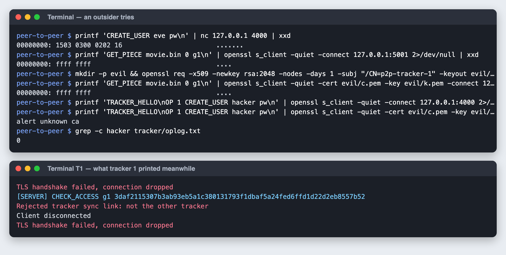

### A fake tracker

A server with the self-made certificate listens on port 4400, and a client is told that this is the tracker:

```
mkdir -p viafake && echo "127.0.0.1:4400" > viafake/tracker_info.txt && cp ca_cert.pem viafake/
openssl s_server -quiet -accept 4400 -cert evil/c.pem -key evil/k.pem > viafake/received.txt 2>&1 &
cd client && ./client 127.0.0.1:5004 ../viafake/tracker_info.txt; cd ..
kill %1; wc -c < viafake/received.txt
```

Expected: `TLS handshake with 127.0.0.1:4400 failed (it did not prove to be a tracker), skipping it`. The 140 bytes in `received.txt` are the fake server's own handshake error (`cat` it to see): the client sent it no command.

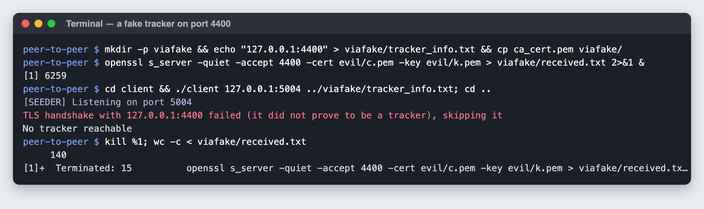

### Someone listening in the middle

`tools/mitm_relay.py` passes every byte between a client and tracker 1 and keeps a copy.

```
mkdir -p viarelay && echo "127.0.0.1:4300" > viarelay/tracker_info.txt && cp ca_cert.pem viarelay/
python3 tools/mitm_relay.py 4300 4000 viarelay/wire.bin &
cd client && ./client 127.0.0.1:5004 ../viarelay/tracker_info.txt
```

Inside that client:

```
create_user dave SuperSecret99
login dave SuperSecret99
quit
```

Then:

```
cd .. && kill %1
wc -c < viarelay/wire.bin
grep -a -c 'SuperSecret99' viarelay/wire.bin; grep -a -c 'LOGIN' viarelay/wire.bin
```

Expected: a few thousand bytes went through the listener, and the password and the word `LOGIN` appear in them `0` times.

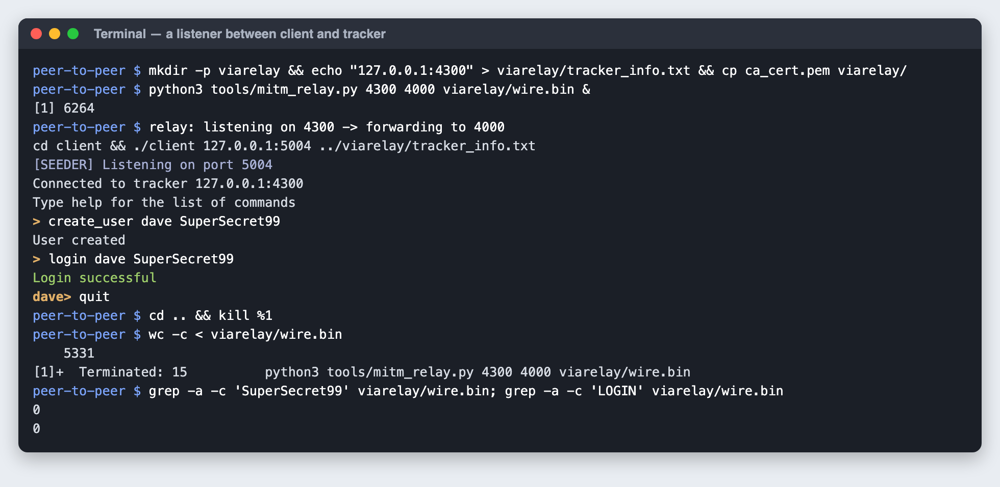

### New keys for the trackers

Stop a tracker, run `make cert` in `tracker/` again, start the tracker. Clients keep their `ca_cert.pem` and connect as before: they trust the authority, not one particular tracker certificate.

---

## Start again from nothing

Type `quit` in every terminal, then in the project folder:

```
rm -f tracker/oplog.txt
rm -f client/.shared_alice client/.shared_bob client/.shared_carol client/.shared_dave
rm -f client/DOWN_testfile.txt client/bob_movie.bin client/carol_movie.bin client/carol_again.bin
```

---

## Shortcut script

`run.sh` does the same things with short commands. It keeps its files in `~/p2p`, one folder per client, so downloads need no renaming.

```
./run.sh setup          # build, make certificates, make the folders and two test files
./run.sh t1             # one terminal each
./run.sh t2
./run.sh alice          # also: bob, carol, dave
```

| Command | What it checks |
|---|---|
| `./run.sh check [file]` | bob's and carol's copy is identical to alice's |
| `./run.sh oplog` | shows the trackers' log |
| `./run.sh passwords` | no password is in the log |
| `./run.sh plain` | the tracker refuses a connection without TLS |
| `./run.sh stranger` | a seeder refuses a non-member |
| `./run.sh faketracker` | a client refuses a fake tracker |
| `./run.sh fakesync` | a tracker refuses a fake "other tracker" |
| `./run.sh spy` | a listener in the middle sees no password |
| `./run.sh newkeys` | new keys for the trackers, clients unchanged |
| `./run.sh leaks` | memory leak check (macOS) |
| `./run.sh reset` | forget all users, groups and shares |

---

## Problems you may see

| Message | What to do |
|---|---|
| `Cannot load ../tracker1_cert.pem ...` or `Cannot load the certificate authority's certificate ...` | Run `make cert` in `tracker/`. |
| `bind: Address already in use` | That tracker is already running, or another program uses the port. |
| `bind seeder: Address already in use` | Two clients with the same port, or another program uses it. Pick another port. |
| `TLS handshake with ... failed` | The client's `ca_cert.pem` is not from the authority that signed the tracker's certificate. Copy the current one. |
| `Login failed` with the right password | The account is from an old `oplog.txt`. Start again from nothing. |
| `You already have movie.bin` | That client already uploaded or downloaded it. |
| `No peers are sharing ... right now` | Every seeder of the file is logged out. |
| A login pauses for a moment | Normal: the password is being hashed, slowly on purpose. |
| `fatal error: openssl/ssl.h not found` | Install the OpenSSL headers (see Requirements). |

---

## Commands

Command names are case-insensitive. `help` prints this list in the client.

| Command | Notes |
|---|---|
| `create_user <user_id> <password>` | |
| `login <user_id> <password>` | Also registers the client's address with the tracker. A new login replaces an older session of the same user. |
| `logout` | Ends the session, cancels running downloads, and stops the tracker handing out this client's address. |
| `create_group <group_id>` | The user becomes the owner. |
| `join_group <group_id>` | Sends a join request to the owner. |
| `leave_group <group_id>` | If the owner leaves, another member becomes owner; an empty group is deleted. |
| `list_groups` | |
| `list_requests <group_id>` | Owner only. |
| `accept_request <group_id> <user_id>` | Owner only. |
| `upload_file <group_id> <file_path>` | Members only. Shares the file under its base name. |
| `list_files <group_id>` | Members only. Prints `<file_name> <size> <uploader>` per file. |
| `download_file <group_id> <file_name> <destination_path>` | Members only. The destination is a directory or the path of the new file. Runs in the background. |
| `show_downloads` | `[D] [group_id] file_name  done/total pieces (percent)` while downloading, `[C] [group_id] file_name` when completed, `[F] [group_id] file_name` when failed. |
| `stop_share <group_id> <file_name>` | The file is removed from the group once nobody shares it. |
| `verbose on\|off` | Logs every piece served and fetched, with the peer it came from. Off by default. |
| `help`, `quit` | `quit` cancels running downloads and exits. |

---

## Architecture

```
tracker/server.cpp     sockets, one thread per client, sync link to the other tracker, console
tracker/commands.cpp   state, command handling, permission checks, oplog
tracker/tls.cpp        TLS: this tracker's certificate, handshakes
tracker/password.cpp   salted PBKDF2 password hashes
client/client.cpp      shell, tracker connection and failover
client/peer.cpp        seeder, downloader, table of shared files
client/tls.cpp         TLS: tracker certificate check, this client's key pair, peer fingerprints
client/threadpool.cpp  fixed-size thread pool
client/fileutils.cpp   SHA-1 of a buffer; whole-file and per-piece hashes of a file
```

Tracker
- One thread per connected client. All state lives in memory behind a single mutex (`state_lock`), so every command is applied atomically.
- A password is hashed as soon as it arrives (PBKDF2-HMAC-SHA256, 600,000 rounds, a random salt per user), before the state mutex is taken. Only the hash is kept in memory, written to `oplog.txt` and sent to the other tracker; a login is logged as `LOGIN <user>`; the console shows `****`.
- The tracker ties a login to the client's connection. A client can only act as the user it logged in as, and is logged out automatically when it disconnects.
- Every operation that changes state is appended to `oplog.txt` and forwarded to the other tracker.

Client
- The main thread runs the shell and talks to the tracker.
- A seeder accept thread hands incoming peer requests to a pool of 8 worker threads.
- `quit` cancels the downloads, stops the seeder and joins all threads before exiting.
- Downloads run on a second pool of 8 worker threads shared by all downloads, so the shell stays usable.
- The tracker connection is shared between the shell and the download threads and is guarded by a mutex.

---

## Key algorithms

### Tracker synchronization
- Every operation that changes state gets a sequence number from the tracker that accepted it and is appended to `oplog.txt` as `<tracker_no> <seq> <command>`. Failed commands and read-only commands are not logged.
- Each tracker keeps an outgoing TCP link to the other one and retries every second while it is down. A new operation is applied locally, logged, then sent over the link as `OP <seq> <command>`. The receiver applies it without the permission checks and without logging it again.
- **Catching up after a disconnect**: whenever the link comes up, the receiving tracker first says how many of the sender's operations it has already applied (`HAVE <seq>`). The sender reads its own later operations back from the oplog and resends them before forwarding anything new. The receiver skips sequence numbers it has already applied, so resending is always safe. This covers a tracker that was down and a network partition between two running trackers.
- **Restart**: a tracker rebuilds its state by replaying `oplog.txt`. When both trackers share the file (same directory), the replay already contains the other tracker's operations in their original order; anything newer arrives through the catch-up above.
- Each log line is written with a single `write()` on an `O_APPEND` descriptor so lines from the two processes never interleave.
- `quit` wakes every tracker thread by shutting down its socket and waits for the threads to finish. The sessions of its clients are left as they are: the clients move to the other tracker and log in there.

### Tracker failover (client)
- When a request fails because the tracker is gone, the client connects to the other tracker, logs the user in again, registers its address, and resends the request. The user only sees a "switching" message.
- Running downloads are not affected: they only talk to peers.

### Parallel download and piece selection
1. `download_file` gets the file size, the SHA-1 of the file and of every piece, and the addresses and key fingerprints of the peers sharing it.
2. The client registers itself as a seeder of the file and starts the download in the background.
3. It asks every peer which pieces it has (`GET_BITFIELD`).
4. **Rarest first**: pieces are ordered by how many peers have them, fewest first, with random order among equals. Rare pieces get replicated before their few holders leave, and the random tie-break keeps simultaneous downloaders from all asking for the same piece.
5. Four pieces of a file are in flight at a time. Each piece is requested from the peer that has it and currently has the fewest requests from this download, which spreads the load over all peers.
6. After each piece the task goes back to the end of the pool's queue, so several downloads share the worker threads fairly.
7. Each piece is checked for length and SHA-1 as soon as it arrives, then written at its offset with `pwrite`.
8. A piece that fails (unreachable or stalled peer, a peer with the wrong key, wrong hash) is retried from another peer and that peer is not asked for it again. A peer that fails 3 times in a row is dropped. If no peer currently has a piece, the client waits a second and asks for the bitfields again, since peers that are still downloading gain pieces over time.
9. When all pieces are in, the SHA-1 of the whole file is checked and the file is renamed from `<destination>.part` to its final name.

A failed or cancelled download deletes its `.part` file and withdraws the client from the file's seeders on the tracker.

### Seeding
- The seeder serves a file only if this client uploaded it, downloaded it, or is downloading it. A request for any other name or path is refused.
- It serves it only to members of the group the file is shared in. The downloader proves a key in the TLS handshake and names the group in its request; the seeder asks the tracker (`CHECK_ACCESS`) whether the holder of that key is a logged-in member of that group. An `Allowed` is reused for 30 seconds, a `Denied` for 2. If the tracker cannot be asked, the request is refused.
- While a download is running, the pieces already verified are served from the `.part` file, so a client that is still downloading is already a source for anyone who starts after it. (A download asks the tracker for peers once, when it starts, so it does not pick up peers that join later.)
- The table of shared files (name, group, path) is kept in `.shared_<user>` in the client's working directory, so seeding resumes when the client is restarted from the same directory.

### Thread pool
`ThreadPool` starts a fixed number of worker threads that take `std::function<void()>` tasks from a FIFO queue protected by a mutex and a condition variable. A fixed pool bounds the number of threads and sockets however many peers connect or downloads are started.

---

## Data structures

Tracker (`commands.cpp`)

| Structure | Purpose |
|---|---|
| `map<string, User> users` | Password hash and logged-in flag per user |
| `map<string, string> groups` | Group -> owner |
| `map<string, set<string>> members` | Group -> members; a set makes the membership checks cheap |
| `map<string, vector<string>> requests` | Group -> pending join requests, in arrival order |
| `map<string, vector<FileMeta>> group_files` | Group -> files: size, file SHA-1, piece SHA-1s, set of seeders |
| `map<string, string> seeder_addr` | User -> `<ip>:<port> <key_fingerprint>`, present only while logged in |
| `map<int, string> conn_user`, `map<string, int> user_conn` | Client connection <-> logged-in user |

Client (`peer.cpp`)

| Structure | Purpose |
|---|---|
| `map<string, Share> g_shared` | File name -> local path and groups of the files this client seeds |
| `DownloadJob` | One download: peers, pending piece queue (`deque<int>`), pieces already held, retry counts |
| `PeerState` | Per peer: its address and key fingerprint, its bitfield (`vector<bool>`), requests in flight, consecutive failures |
| `ThreadPool` | Worker threads and task queue |

---

## Network protocols

All communication is over TCP, inside TLS 1.2 or newer. The messages below are what travels inside the TLS connection.

### Client <-> tracker (text)
Request: one line, space separated. Reply: one or more lines followed by a line containing only `END`. The client translates each command into a request that names the acting user, which is also the form used between the trackers and in `oplog.txt`:

```
CREATE_USER <user> <password>          LOGIN <user> <password>
LOGOUT <user>                          REGISTER_ADDR <user> <ip:port> <key_fingerprint>
CREATE_GROUP <group> <user>            JOIN_GROUP <group> <user>
LEAVE_GROUP <group> <user>             LIST_GROUPS
LIST_REQUESTS <group>                  ACCEPT_REQUEST <group> <user>
LIST_FILES <group>                     STOP_SHARE <group> <file> <user>
CHECK_ACCESS <group> <key_fingerprint>
UPLOAD_FILE <group> <user> <file> <size> <file_sha1> <num_pieces> <piece_sha1>...
DOWNLOAD_FILE <group> <file>
```

`DOWNLOAD_FILE` replies with `<file> <size> <file_sha1> <num_pieces>`, then one piece SHA-1 per line, then one `<ip>:<port> <key_fingerprint>` per line for every seeder that is online. `<key_fingerprint>` is the SHA-256 of the client's certificate, 64 hex digits.

`CHECK_ACCESS` is sent by a seeder (members of the group only) and replies `Allowed` if a logged-in member of the group registered that fingerprint, otherwise `Denied`.

In `oplog.txt` and between the trackers, `CREATE_USER` carries `pbkdf2-sha256$<rounds>$<salt>$<hash>` in place of the password and `LOGIN` carries only the user.

Errors are single-line messages such as `Login failed`, `No group`, `User not in group`, `Only the group owner can accept requests`, `Permission denied: you are logged in as <user>`, `Not logged in`.

### Tracker <-> tracker (text)
A tracker connects to the other tracker's port and sends `TRACKER_HELLO`. The other side answers `HAVE <seq>`, the highest sequence number up to which it has applied all of the sender's operations. Every following line is `OP <seq> <request>`, one state-changing request in the format above. The link is only accepted from a connection that presented a certificate signed by the authority in the TLS handshake, and from the address of the other tracker in `tracker_info.txt` (or from the local machine).

### Client <-> client (binary reply)
Request: one text line. Reply: a 4-byte length in network byte order followed by that many bytes. The length `0xFFFFFFFF` means the request was refused.

| Request | Reply data |
|---|---|
| `GET_BITFIELD <file> <group>` | One byte per piece: `1` if the peer has it, `0` if not |
| `GET_PIECE <file> <index> <group>` | The piece |

Both ends present their certificate in the TLS handshake. The request is refused unless the file is shared in `<group>` and the tracker allows the requester's key for that group. Every refusal looks the same.

One request per connection. Connecting, the handshake, sending and receiving all time out after 5 seconds, so a stalled peer cannot hang a download.

---

## Security

The threat is a man in the middle: someone on the network path who can read, change, drop or inject traffic, or who answers on the address of a tracker or a peer.

| Link | How the other side is identified | What a man in the middle gets |
|---|---|---|
| Client -> tracker | The tracker must present a certificate signed by the authority in `ca_cert.pem`, the only thing the client trusts, and prove it holds the matching key. | Encrypted bytes. A fake tracker fails the handshake before the client has sent anything. |
| Tracker -> tracker | Both ends present their authority-signed certificate. `TRACKER_HELLO` is refused on a connection that did not. | Encrypted bytes. It cannot inject operations: it has no such key. |
| Client -> client | Each client creates a key pair when it starts and sends the fingerprint of its certificate to the tracker with `REGISTER_ADDR`. The tracker hands the fingerprint out with the address. The downloader checks, after the handshake and before sending its request, that the peer's certificate has that fingerprint. The seeder learns the downloader's fingerprint from the same handshake and checks it with the tracker. | Encrypted bytes. A fake peer on the right address is dropped and counted as a failed peer. |

- The trust starts at one file, `ca_cert.pem`, which has to reach each client by a safe route (the same one as `tracker_info.txt`). Everything else follows from it: the fingerprints of the peers and the SHA-1 of every piece arrive over the checked tracker connection.
- Any certificate the authority signed is accepted as a tracker; the host name in it is not looked at. The authority signs nothing but tracker certificates.
- Each tracker has its own key. A tracker's key is replaced by issuing a new certificate (`make cert`); clients are not involved.
- With TLS 1.3 the session keys come from a fresh key exchange on every connection, so recorded traffic stays unreadable even if a tracker's key leaks later.
- A client's key pair lives only in memory and is replaced on every start.
- There is no unencrypted mode to fall back to.

Beyond the network:

- **Passwords.** Stored, logged and replicated only as salted PBKDF2-HMAC-SHA256 hashes (600,000 rounds). A stolen `oplog.txt` gives hashes that have to be guessed one user at a time, slowly. The stored hash cannot be used to log in: the tracker hashes whatever a client sends. A failed login for an unknown user does the same amount of work as for a known one.
- **Who may download.** A seeder serves a piece only after the tracker confirmed that the key the requester proved to hold belongs to a logged-in member of the group. Leaving the group or logging out ends access within 30 seconds.

What this does not cover is listed under Limitations.

---

## Assumptions
- Both trackers are started from the same directory so that they share `oplog.txt`. They also synchronize when started from different directories, but a restarted tracker then replays its own operations before the other tracker's instead of in their original order.
- User, group and file names contain no whitespace. `END` is not allowed as a user or group name.
- A file is identified by its base name within a group. Uploading a different file under a name that already exists in the group is rejected.
- The address given to the client on the command line is reachable by the other peers.
- `ca_cert.pem` reaches every client unchanged, each tracker's key is readable only by that tracker, and `ca_key.pem` is kept away from both.
- An `oplog.txt` or `.shared_<user>` written before passwords were hashed and shares carried a group is not carried over: delete them (the old oplog contains passwords) and create the users and uploads again.
- A client is restarted from the same directory if it should keep seeding its files.

---

## Limitations
- Each piece request opens a new TCP connection; connections to a peer are not reused.
- An interrupted download starts from scratch; partial files are not resumed.
- A download asks the tracker for peers once, when it starts, and asks each peer what it has at the start and again only when it is stuck. Peers that join later, and pieces a peer gains meanwhile, are not used by a download that is already running.
- Two operations accepted by different trackers at the same moment (or on both sides of a partition) may be applied in a different order on each tracker; there is no conflict resolution beyond the checks each command makes.
- A session whose tracker crashed stays marked as logged in until that user logs in again (the client does this by itself when it fails over).
- Login attempts are not limited. Passwords can be guessed online, and every attempt costs the tracker about 0.15 s of CPU.
- There is no certificate revocation: a stolen tracker key can be used until its certificate expires (one year), or until the authority itself is replaced on every client.
- The tracker is trusted completely. It sees every password as it arrives, names the peers, and decides who is in a group.
- A seeder needs a tracker to confirm a new downloader. While no tracker is reachable it serves only downloaders it confirmed in the last 30 seconds.
- A member who leaves a group can still be served for up to 30 seconds, and keeps whatever was already downloaded.
- Every piece request makes a full TLS handshake (connections and TLS sessions are not reused).
